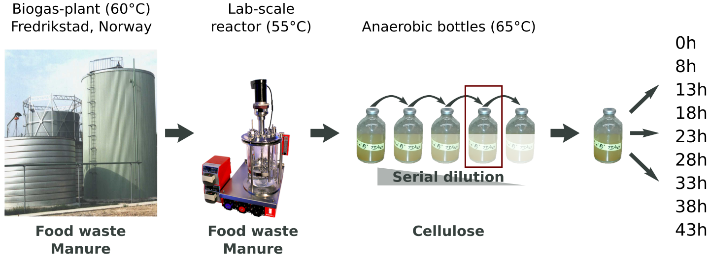
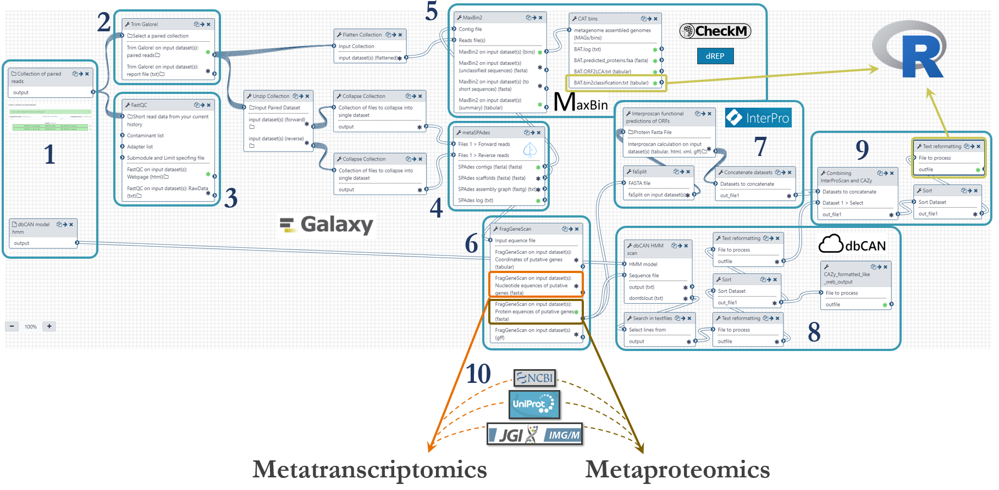

Integrative meta-omics in Galaxy
================================
By Magnus Ø. Arntzen (Norwegian University of Life Sciences) and Bjoern Gruning (University of Freiburg)  
(This post is also available as a [poster](2020-JGI-Galaxy.pdf))

**Abstract:**
-------------
The meta-omics technologies have provided scientists with methods for addressing the complexity of microbial communities on a scale not attainable before. Individually, the different techniques can provide great insight; while in combination, they can provide a detailed understanding of which organisms occupy specific metabolic niches, how they interact, and how they utilize environmental nutrients.  

In this post we will describe the adaption of a repertoire of commonly used omics tools spanning all three technologies (metagenomics, -transcriptomics and -proteomics) into the Galaxy framework, in order to generate a user-accessible, scalable and robust analytical pipeline for integrated meta-omics analysis.  

We have applied this pipeline to deconvolute a highly efficient cellulose-degrading minimal consortium isolated and enriched from a [biogas reactor in Fredrikstad, Norway](http://www.frevar.no/). Metagenomic analysis recovered metagenome-assembled genomes (MAGs) for several constituent populations including *Hungateiclostridium thermocellum*, *Acetomicrobium mobile* and multiple heterogenic strains affiliated to *Coprothermobacter proteolyticus*. Metatranscriptomic and metaproteomic analysis revealed co-expression of carbohydrate-active enzymes ([CAZymes](http://www.cazy.org/)) from multiple populations, inferring deeper microbial interactions that are dedicated towards co-degradation of cellulose and hemicellulose. By combining meta-omics methods, we have been able to identify and describe key roles played by specific uncultured microorganisms in complex biomass degradation processes.

**The dataset:**
----------------
The sample studied in this work originated from a thermophilic biogas-plant operated on muncipal food waste and manure. After a round in a lab-scale reactor, we performed a serial dilution to extinction experiment to simplify and enrich the community for growth on cellulose (Norwegian Spruce). 

**Metagenomics:**
-----------------
An Illumnia HiSeq 3000 platform was used for metagenomics shotgun sequencing of the microbial community. Samples were sequenced with paired ends (2 x 125 bp) on four lanes. These were the steps of the metagenomics analysis workflow, numbered according to the figure below:
1.	Fastq-files were uploaded to [Galaxy via ftp](https://galaxyproject.org/tutorials/collections/#uploading-from-ftp) (~45Gb per file) and organized as a [Collection of paired datasets](https://galaxyproject.org/tutorials/collections/). The Hidden Markov Model (HMM) for prediction of CAZymes was downloaded from http://bcb.unl.edu/dbCAN2/download/ and uploaded to Galaxy.
2.	Trimming of reads were done with [Trim Galore!](https://www.bioinformatics.babraham.ac.uk/projects/trim_galore/) with automatic detection of adapter sequences.
3.	Quality control with [FastQC](https://www.bioinformatics.babraham.ac.uk/projects/fastqc/) to assess the overrepresentation of features (adapters/primers) and Phred threshold of 20.
4.	To assemble metagenomic reads into contigs we used [metaSPAdes](http://cab.spbu.ru/software/meta-spades/) with k-mer sizes of 21,33,55 and 77.
5.	Binning of contigs was done based on an expectation-maximization algorithm using [MaxBin2](https://sourceforge.net/projects/maxbin2/). We used a minimum contig length of 5000. Taxonomical placement was done with the [Bin Annotation Tool](https://github.com/dutilh/CAT), and each bin’s completeness, contamination and strain heterogeneity was checked using [CheckM](https://ecogenomics.github.io/CheckM/) (currently not in Galaxy). We are also working on an implementation of [dREP](https://drep.readthedocs.io/en/latest/overview.html) (that also include CheckM) for further validation of the bins. The abundance table provided by MaxBin2 were used to generate a cluster plot to visualize the bins (figure further down).
6.	We predicted genes using the software [FragGeneScan](https://omics.informatics.indiana.edu/FragGeneScan/)
7.	The putative proteins from FragGeneScan  were functionally annotated using [InterProScan](https://www.ebi.ac.uk/interpro/) with the following databases: TIGERFAM, HAMAP, PfamA, Gene Ontology, EC and KEGG.
8.	Prediction of CAZymes were done using the Hidden Markov Models from [dbCAN](http://bcb.unl.edu/dbCAN2/) and the software [HMMER](http://hmmer.org/). 
9.	We then combined all the functional annotations from InterProScan and dbCAN into one file for downstream analysis using the Galaxy implementation of awk to generate a tabular with one protein per row and the different annotations in individual columns. This file was used as input of R-scripts to count the presence of specific enzymes in the metagenome (described further down).
10.	The putative genes and proteins (fasta-files) from FragGeneScan can be manually augmented with strains from public repositories such as [NCBI](https://www.ncbi.nlm.nih.gov/genome), [UniProt](https://www.uniprot.org/) or [IMG](https://img.jgi.doe.gov/cgi-bin/w/main.cgi).  

